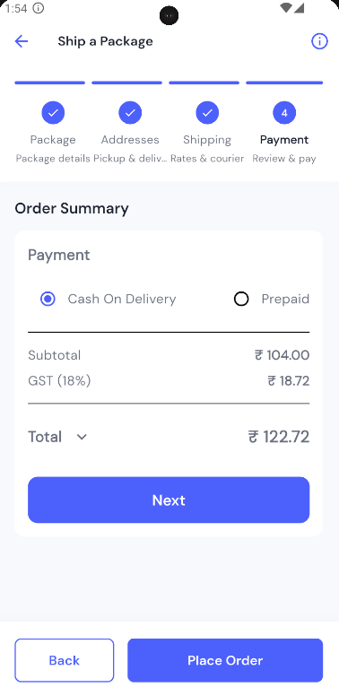

# Shiplee - Shipping App

A modern, feature-rich shipping app built with Flutter that allows users to compare shipping rates from multiple couriers, book shipments, and track orders in real-time.

## Features

- **Courier Comparison**: Compare shipping rates from multiple courier services
- **Shipment Booking**: Easy package details entry and address selection


## Screenshots

<table>
  <tr>
    <td></td>
    <td></td>
    <td></td>
  </tr>
  <tr>
    <td></td>
    <td></td>
  </tr>
</table>

## Tech Stack

- **Frontend**: Flutter, Dart
- **State Management**: Riverpod
- **Backend**: Node.js (see [backend folder](./backend))
- **Database**: SQLite


## Getting Started

### Prerequisites

- Flutter (latest stable version)
- Dart SDK
- Android Studio / Xcode for emulators

### Installation

1. Clone the repository:
   ```
   git clone https://github.com/yourusername/shiplee.git
   ```

2. Navigate to the project directory:
   ```
   cd shiplee
   ```

3. Install dependencies:
   ```
   flutter pub get
   ```

4. Run the app:
   ```
   flutter run
   ```

### Backend Setup

For setting up the backend server, please refer to the [backend README](./backend/README.md).

## State Management

This app uses Riverpod for state management. The main providers include:

- Order providers for managing shipment orders
- Courier providers for fetching and comparing courier services
- Address providers for managing pickup and delivery addresses
- Authentication providers for user management

## UI Components

The app follows Material Design guidelines with custom components for a modern look and feel. Key components include:

- Custom service cards
- Step-by-step shipment booking process
- Interactive tracking view
- Courier comparison cards

