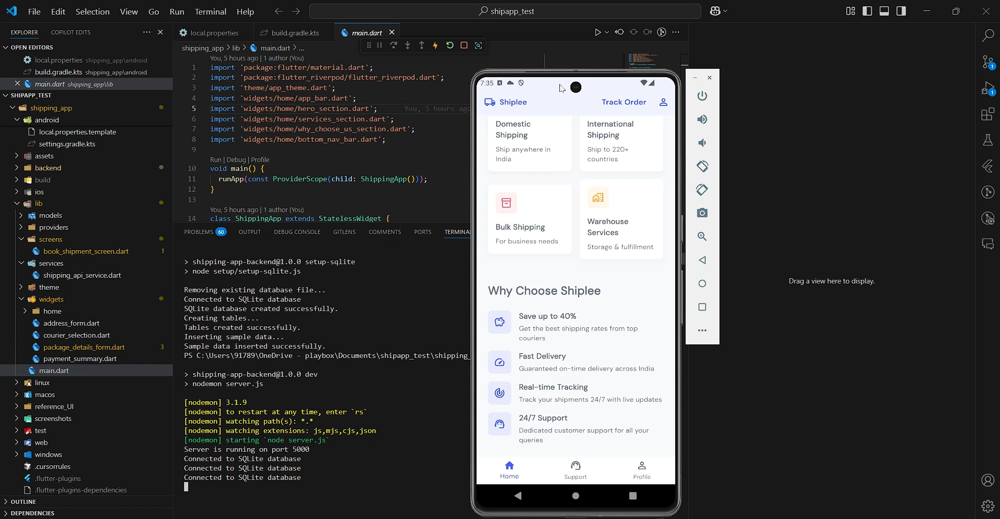

# Shiplee - Shipping App (Internship task)

A modern, feature-rich shipping app built with Flutter that allows users to compare shipping rates from multiple couriers  and book shipments.

## ⚠️ Important: Setup Order
This project consists of two parts that must be set up in the correct order:
1. **Backend Server** (Must be set up and running first)
2. **Flutter App** (Set up after backend is running)

## Features

- **Courier Comparison**: Compare shipping rates from multiple courier services
- **Shipment Booking**: Easy package details entry and address selection

## 🎥 Demo Video

<div align="center">
  <a href="screenshots/demo_vid.mp4">
    
  </a>
  <p><em>👆 Click to watch the demo video</em></p>
</div>

### Key Features Demonstrated
- 📱 app walkthrough


## Screenshots

<table>
  <tr>
    <td></td>
    <td></td>
    <td></td>
  </tr>
  <tr>
    <td></td>
    <td></td>
  </tr>
</table>

## Tech Stack

- **Frontend**: Flutter, Dart
- **State Management**: Riverpod
- **Backend**: Node.js with Express
- **Database**: SQLite

## Prerequisites

1. Install Flutter:
   - Download Flutter SDK from [flutter.dev](https://flutter.dev/docs/get-started/install)
   - Add Flutter to your PATH
   - Run `flutter doctor` and fix any issues

2. Install Node.js:
   - Download from [nodejs.org](https://nodejs.org/) (v14 or higher)
   - Verify installation: `node --version` and `npm --version`

3. Install Android Studio:
   - Download from [developer.android.com](https://developer.android.com/studio)
   - Install Flutter and Dart plugins
   - Set up an Android emulator

## Step 1: Backend Setup (Do This First!)

1. Navigate to backend directory:
   ```bash
   cd shipping_app/backend
   ```

2. Install backend dependencies:
   ```bash
   npm install
   ```

3. Set up environment:
   ```bash
   # Create .env file
   echo "PORT=5000" > .env
   ```

4. Initialize database:
   ```bash
   npm run setup-sqlite
   ```

5. Start the backend server:
   ```bash
   npm run dev
   ```

6. Verify backend is running:
   - Open browser to `http://localhost:5000`
   - You should see "Server is running"
   - Keep this terminal window open

## Step 2: Flutter App Setup

Open a new terminal window and:

1. Return to project root:
   ```bash
   cd shipping_app
   ```

2. Set up Android SDK configuration:
   - Copy the template file:
     ```bash
     cp android/local.properties.template android/local.properties
     ```
   - Edit `android/local.properties` with your SDK paths:
     ```properties
     # Windows paths (use double backslashes)
     sdk.dir=C:\\Users\\YourUsername\\AppData\\Local\\Android\\Sdk
     flutter.sdk=C:\\dev\\flutter

     # macOS/Linux paths
     # sdk.dir=/Users/YourUsername/Library/Android/sdk
     # flutter.sdk=/Users/YourUsername/flutter
     ```

3. Get Flutter dependencies:
   ```bash
   flutter pub get
   ```

4. Run the app:
   ```bash
   flutter run
   ```

## Common Issues and Solutions

1. **"Cannot connect to backend" Error**:
   - Ensure you started the backend server FIRST
   - Backend must be running before starting the Flutter app
   - Check if backend is running on `http://localhost:5000`

2. **Database Errors**:
   ```bash
   cd backend
   rm -rf database/shipping_app.db
   npm run setup-sqlite
   ```

3. **Android SDK Not Found**: 
   - Verify paths in `android/local.properties`
   - Ensure Android Studio is properly installed

4. **API Connection Issues**: 
   The app uses different URLs based on platform:
   - Android Emulator: `http://10.0.2.2:5000`
   - iOS Simulator: `http://localhost:5000`
   - Web: `http://localhost:5000`

## Project Structure

```
lib/
├── main.dart                 # Entry point
├── models/                   # Data models
├── providers/                # Riverpod state providers
├── screens/                  # App screens
├── services/                 # API and other services
├── theme/                    # Theme configuration
└── widgets/                  # Reusable UI components
    ├── home/                 # Home screen widgets
    └── ...                   # Other widgets
```

## State Management

This app uses Riverpod for state management. The main providers include:

- Order providers for managing shipment orders
- Courier providers for fetching and comparing courier services
- Address providers for managing pickup and delivery addresses
- Authentication providers for user management

## UI Components

The app follows Material Design guidelines with custom components for a modern look and feel. Key components include:

- Custom service cards
- Step-by-step shipment booking process
- Interactive tracking view
- Courier comparison cards

## Development

For detailed backend API documentation and development guidelines, see [backend/README.md](./backend/README.md).

## Contributing

1. Fork the repository
2. Create your feature branch: `git checkout -b feature/YourFeature`
3. Commit your changes: `git commit -m 'Add YourFeature'`
4. Push to the branch: `git push origin feature/YourFeature`
5. Submit a pull request

## Support

If you encounter any issues:
1. Check the Common Issues section above
2. Open an issue in the repository
3. Provide detailed error messages and steps to reproduce


